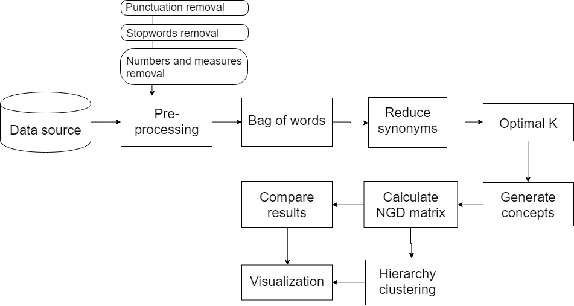
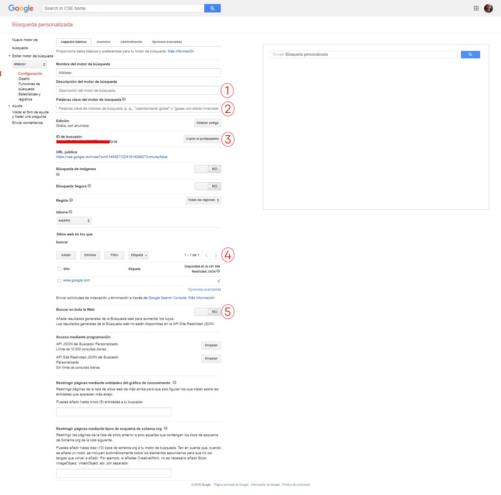
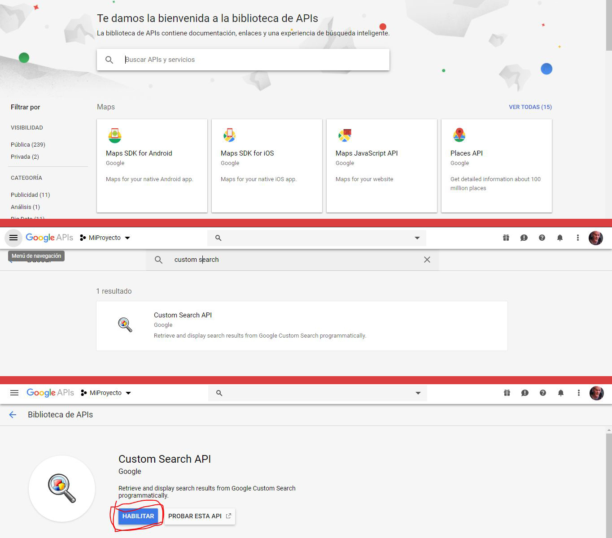
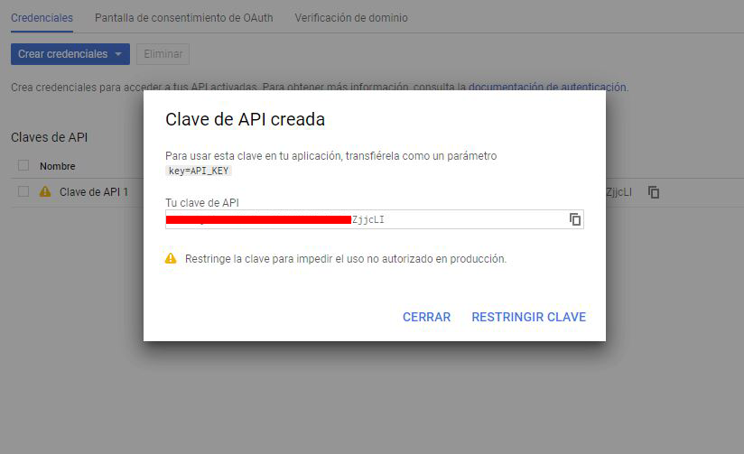

<style type="text/css">


h1.title {
  font-size: 32px;
}
h1 { /* Header 1 */
  font-size: 28px;
}
h2 { /* Header 2 */
  font-size: 22px;
}
h3 { /* Header 3 */
  font-size: 18px;
}

</style>

```{r setup, include=FALSE}
knitr::opts_chunk$set(echo = TRUE)
```

-----------

# Introducción


# Pipeline

> A continuación se muestra el pipeline utilizado



# Dataset

> El conjunto de datos utilizados corresponde a las descripciones textuales de herramientas, equipamientos y materiales requeridos para las maniobras de mantenimiento en la infraestructura de media tensión y microredes.

# Desarrollo

## Configuración inicial

Antes de comenzar con el proceso debemos cargar todas las librerias que se utilizaran a lo largo del proyecto. Cargamos el paquete *easypackages* que nos permite cargar e instalar paquetes con una sola instrucción.

```{r}
# Si no se tiene instalado
# install.packages("easypackages")

library(easypackages)

```

Colocamos todos los paquetes en un vector y lo pasamos como parámetro a la función de *libraries()*.

```{r echo=TRUE, results='hide', message=FALSE, warning=FALSE}
# Todos los paquetes que se necesitan
paquetes <- c("tm", "RWeka", "ggplot2", "tidyr", "tibble", "dplyr", "corrplot",
              "httr", "clValid", "msos", "clusterSim", "tidytext", "wordcloud",
              "stats", "jaccard", "lsa", "gtools", "tidyverse", "MASS","RCurl",
              "XML", "magrittr", "rvest", "knitr")

# Instalar los paquetes
# packages(paquetes)

# Cargar los paquetes
libraries(paquetes)
```

## Extracción de Datos

Cargamos los datos con la ruta donde se encuetran.

```{r}
# Cargamos los datos
load("data/equipment.Rda")
```

Creamos un *data frame* con el nombre del equipo y su identificador numérico, además, se coloca nombre a las columnas para, posteriormente, transformar el data frame en un corpus.

> **"doc_id"** es el identificador de cada documento.

> **"text"** es el contenido del documento

```{r}
# Data frame con los datos: id_equip y equip_name
equipo <- as.data.frame(equipment$id_equip)
equipo <- equipo %>%
  mutate(equipment$equip_name) %>%
  setNames(c("doc_id","text"))

head(equipo)
```

## Limpieza de Datos

En la limpieza de datos, se consume la mayor cantidad de tiempo empleado en el proyecto. El pre-procesamiento de los documentos comienza con la eliminación de acentos, unidades de medidas, números, puntuación, palabras comunes (stopwords), espacios en blanco y cambiar el texto a minúsculas. Con esto se aumenta la eficiencia y solidez de los resultados por la eliminación de palabras que no favorecen esencialmente al análisis.

> Se escribieron las siguientes funciones para quitar las unidades de medidas y palabras con números y letras.

```{r}
# Remover palabras con numeros y letras
remove.alfa_num <- function(x) gsub("[0-9]+[a-z]+|[a-z]+[0-9]+|[a-z]+[0-9]+[a-z]+|tipo", " ", x)

# Remover todas las medidas
remove.measure <- function(x) gsub("\\sx\\s|\\sm\\s|\\scm|\\smm|\\spies|\\spie\\s|\\spie$|\\sno\\s|\\spc|\\sul|\\suc|\\su$|\\sag|\\scu\\s|\\sccf|\\skv|\\srt|\\spv|c\\s|\\m$|adom"," ",x)
```

Se comienza a limpiar los datos.

```{r}
# Quitamos los acentos
equipo$text <- chartr('áéíóúñ','aeioun',equipo$text)

# Se convierte el dataframe en corpus
docs <- VCorpus(DataframeSource(equipo))

docs <- docs %>%
  # Convertir a minusculas
  tm_map(content_transformer(tolower)) %>%
  # Remover palabras con números y letras
  tm_map(content_transformer(remove.alfa_num)) %>%
  # Remover números
  tm_map(removeNumbers) %>%
  # Remover puntuaciones
  tm_map(removePunctuation) %>%
  # Remover unidades de medidas
  tm_map(content_transformer(remove.measure)) %>%
  # Remover stopwords
  tm_map(removeWords, stopwords("spanish")) %>%
  # Remover espacios en blanco
  tm_map(stripWhitespace)

```

## Bolsa de palabras

Aquí se genera la matriz de términos del documento (Document Term Matrix).

> Primero es necesario crear la función que permita crear los tokens en n-grams, compuestos de una, dos y tres palabras. Se usa la función de *NGramTokenizer* y pasamos como parámetro el control con las opciones para generar los distintos Tokens.

```{r}
Uni_to_Tri_Tokenize <- function(x) NGramTokenizer(x, Weka_control(min = 1, max = 3))
```

Se aplica la función de *DocumentTermMatrix* para generar la matriz de términos de documento incluyendo *term frecuency (tf)* , como primer parámetro es el corpus y el segundo es el control para generar los Tokens, por lo tanto, se pasa la función recién creada. 
Al final creamos un objeto de tipo *matrix* a partir de la objeto tipo *DocumentTermMatrix*

```{r}
# Creamos la DTM
dtm <- DocumentTermMatrix(docs, control=list(tokenize=Uni_to_Tri_Tokenize))

# Creamos un objeto matrix
matriz.dtm <- as.matrix(dtm)
```

## Reducción de documentos Sinónimos

Algunos documentos contienen exactamente los mismos tokens con la misma cantidad de apariciones, son documentos con el mismo contenido, por lo tanto pueden ser reducidos utilizando el concepto de “sinónimo”. Para identificar estos documentos se utilizó el índice de Jaccard el cual mide el grado de similitud entre dos conjuntos. Todos los documentos fueron comparados entre si generando una matriz simétrica de los 211 documentos, tomando valores entre 0 y 1,  donde 0 indica que dos conjuntos son totalmente diferentes mientras que 1 que los documentos son iguales o, lingüísticamente, “sinónimos”. Para generar el agrupamiento jerárquico, invertimos esta relación mediante la resta 1 menos la matriz, con esto, los documentos totalmente iguales toman un valor de cero.

> La siguiente función permite generar la matriz completa tomando como parámetro la matriz DTM

```{r}
jaccard.matrix <- function(dtm.matrix){
  # Se crea una matriz identidad del tamaño igual a la cantidad de documentos en el corpus
  temp.mat.jacc <- diag(nrow(dtm.matrix))
  for (i in 1:nrow(temp.mat.jacc)) {
    for (j in i:1) {
      if (i != j) {
        # Se aplica la función jaccard() de la libreria "jaccard"
        temp.mat.jacc[i,j] <-  temp.mat.jacc[j,i] <- jaccard(dtm.matrix[i,], dtm.matrix[j,])
      }
    }
  }
  # Se aplican el mismo nombre de las filas a las columnas
  colnames(temp.mat.jacc) <- 1:nrow(dtm.matrix)
  return(temp.mat.jacc)
}
```

Creamos la matriz con el *índice de Jaccard* y la visualizamos con una gráfica de correlación.

```{r}
# Se crea la matriz con el Índice de Jaccard
jaccard.mat <- jaccard.matrix(matriz.dtm)

# Gráfica de correlación
corrplot(jaccard.mat, is.corr = F, method = "circle")
```

Para tener una mejor visualización de los datos se graficaran los primeros 30 elementos.

```{r}
# Gráfica de correlación
 corrplot.mixed(jaccard.mat[1:30,1:30], is.corr = F, lower.col = "black", number.cex = .7, tl.pos = "lt")
```

Se observa que los documentos del 1 al 7 su valor es 1, por lo tanto, son sinónimos. Los documentos 25 y 26 también cumplen la condición. Estos documentos deben ser comprimidos para tener en la matriz documentos únicos.

Se invierte la relación mediante la resta 1 menos la matriz, se aplica agrupamiento jerárquico con la función *hclust* y se grafica el dendrograma.

```{r}
plot(hclust(as.dist(1-jaccard.mat[1:30,1:30])))
```

Trabajando con el mismo subconjunto de datos se observa que los documentos del 1 al 7 están agrupados al final del dendrograma con una distancia igual a 0 al igual que los documentos 25 y 26.

Ahora con la función *cutree* se agrupara la matriz  de acuerdo a su distancia, en este caso con una distancia igual a 0.

```{r}
# Se crea el árbol de agrupamiento jerárquico
hclust.obj <-  hclust(as.dist(1-jaccard.mat))

# Crear grupos con distancia igual a 0
# Guardaremos el grupo al que pertenece cada documento en un vector
vector.words.cluster <- cutree(hclust.obj, h=0)


nuevos.equipos <-  as.matrix(vector.words.cluster)
```

Extraemos el ID del documento cuando los valores son únicos dentro del vector con el número de cluster al que pertenece cada documento, después, creamos una matriz con dos columnas, la primera será para el ID de los documentos únicos y la segunda el contenido de cada documento.

```{r}
# Como nombre de columna colocamos el ID de cada documento
rownames(nuevos.equipos) <- equipo$doc_id
# Documentos únicos
new.equip <- rownames(unique(nuevos.equipos))
# Creamos la matriz con los documentos únicos
nuevos.equipos <- matrix(new.equip, nrow=length(new.equip), ncol=2)
# Colocamos el contenido de cada documento
for (i in 1:length(new.equip)) {
  nuevos.equipos[i,2] <- docs[[new.equip[i]]]$content
}
# Convertimos a dataframe
nuevos.equipos <- as.data.frame(nuevos.equipos)
# Cambiamos el nombre a las columnas
colnames(nuevos.equipos) <- c("doc_id", "text")

head(nuevos.equipos)
```

Una vez que tenemos los documentos únicos vamos a convertirlos a *corpus* para crear la nueva DTM

```{r}
# Convertimos en Corpus
docs.sin.repetir <- VCorpus(DataframeSource(nuevos.equipos))

# Creamos la DTM a partir del corpus nuevo
dtm <- DocumentTermMatrix(docs.sin.repetir, control=list(tokenize=Uni_to_Tri_Tokenize))

# Guardamos como matriz
matriz.dtm <- as.matrix(dtm)

# Aplicamos el índice de Jaccard para la nueva matriz DTM
jaccard.mat.new <- jaccard.matrix(matriz.dtm)

# Cambiamos el nombre de las filas y columnas por el ID del documento.
rownames(jaccard.mat.new) <- rownames(matriz.dtm)
colnames(jaccard.mat.new) <- rownames(matriz.dtm)
```

Observamos la matriz con agrupamiento jerárquico.

```{r}
plot(hclust(as.dist(1-jaccard.mat.new)))
```

## Selección óptimo de K clusters

La siguiente etapa consta en calcular la cantidad óptima de agrupaciones que tendrá nuestro corpus. Primero se crea una matriz con la similitud coseno entre cada documento, esta similitud evalúa el valor coseno del ángulo comprendido entre dos documentos en el espacio siendo 1 cuando ambos documentos son iguales. A partir de esta matriz de distancia se comienzan a evaluar el número de agrupaciones, es importante mencionar que no existe un criterio objetivo para la elección de un numero óptimo de Clusters (agrupaciones), pero podemos usar métodos aproximaciones para medir la calidad del resultado. En nuestro caso, se utiliza el método de Anchura promedio de Silueta, el cual mide cuán la pureza de un cluster en términos de la similitud de los objetos de un grupo en comparación con los elementos del resto.

Creamos una matriz con la similitud de coseno que nos encontrara la relación entre los documentos, para poder utilizar la función es necesario transponer la matriz *dtm*. Se invierte la relación mediante la resta 1 menos la matriz y se aplica agrupamiento jerárquico con la función *hclust*.

```{r}
# Pasamos como parametro la matriz dtm transpuesta
coseno.matriz <- cosine(t(matriz.dtm))

# Aplicamos agrupamiento jerárquico
hclust.obj <-  hclust(as.dist(1-coseno.matriz))
```

Creamos un vector con los números de clusters para probar y un objeto donde vamos a guardar los promedios para cada cluster

```{r}
# Vector con el número de clusters
num.pruebas <- 2:100

# Objeto para guardar todos los promedios del método de la silueta.
sil.promedio <- 0
```

El siguiente ciclo recorrerá todos los clusters y calculara la anchura promedio de Silueta.

```{r}

for (i in num.pruebas) {
  # Calculamos la anchura de la silueta
  sil_clu <- silhouette(cutree(hclust.obj, k=i) ,as.dist(1-coseno.matriz), full=T)
  # Calculamos el promedio
  sil.mean.temp <- mean(sil_clu[,3]) 
  # Guardamos el promedio
  sil.promedio[i-1] <-  sil.mean.temp
}
```

Creamos un *data frame* con el número de cluster y el promedio de la anchura de Silueta para graficar los resultados.

```{r}
# Data frame con el número de cluster y promedio de la anchura de Silueta
df.data.sil <- tibble(
  cluster = num.pruebas,
  sil.mean = sil.promedio
)

# Grafica del metodo de la silueta
df.data.sil %>%
  ggplot(aes(x=cluster, y=sil.mean)) +
  geom_point() +
  geom_line() +
  labs(x="N. Cluster", y="Average Silhouette", title="Matriz Coseno")
```

Buscamos el valor que más se acerque a 1, el número de clusters optimo es cuando hay 86 pero la diferencia con el 85 clusters es mínima, por lo tanto, podemos tomar como número optimo 85 de acuerdo a un [principio](https://es.wikipedia.org/wiki/Navaja_de_Ockham#En_estad%C3%ADstica) en la estadística el cual debe seleccionarse la combinación más reducida y simple posible de un modelo a estudiar.
```{r}
k.optimo <- 85
```

## Generación de Conceptos

Ahora se tienen 85 clusters en el que cada uno contiene al menos un documento, en algunos casos se obtuvieron agrupaciones con 5 documentos, en este caso, se obtienen las cinco palabras más frecuentes de cada grupo. Estas palabras representan el contenido del grupo.

El primer paso es crear la agrupación con el número de clusters óptimo, después, crearemos una matriz con el contenido de los documentos y el cluster al que perteneces. Una vez que creamos la matriz la convertimos en un *data frame* y colocamos el nombre a las columnas.

```{r}
# Aplicamos hclust con el k.optimo
vector.clusters <- cutree(hclust.obj, k=k.optimo)

# Generaremos una matriz con el contenido de los documentos y
# el cluster al que pertenecen.
matriz.doc.cluster <- as.matrix(nuevos.equipos$text)
matriz.doc.cluster <- cbind(matriz.doc.cluster, vector.clusters)

#Lo convertimos en un dataFrame y le cambiamos el nombre a las columnas
df.doc.cluster <- as.data.frame(matriz.doc.cluster)
colnames(df.doc.cluster) <- c("id.doc","cluster")

head(df.doc.cluster)
```

Se crea una función que será la encargada de tomar el top 5 de cada cluster, pasamos como parámetro los documentos de cada cluster y retornamos las cinco palabras más usadas en un formato listo para realizar las consultas para la NGD, se coloca el signo **+** como separación entre palabras.

```{r}
top.5.words <- function(cluster) {
  # Se extraen las primeras 20 palabras de cada cluster
  top20.palabras <- as.data.frame(sort(cluster, T) %>% head(20))
  # Ordenamos las palabras
  top5pala <- sort(table(strsplit(paste(rownames(top20.palabras), collapse = " "), " ")), T) %>% head(5)
  # Retornamos las cinco palabras en formato para NGD.
  top5pala <- paste(rownames(top5pala), collapse = "+")
  return(top5pala)
}
```

Creamos un ciclo que recorrerá cada cluster y extraerá sus documentos los cuales pasaran a la función para extraer las 5 palabras más utilizadas y se colocaran en un vector.

```{r}
# Vector para guardar las top 5 palabras de cada cluster
total.top5 <- 0

for (i in 1:k.optimo) {
  temp <- df.doc.cluster %>%
    filter(cluster==i)
  total.top5[i] <- top.5.words(temp$text)  
}

head(total.top5)
```


## Calculo de NGD

La sección se divide en tres, la primera corresponde a la función en R para la Distancia Normalizada de Google, la segunda sección se muestra la configuración de la API Google Custom Search y, al final, se construye la matriz con la NGD.

### Función NGD

La distancia normalizada de Google es una medida de similitud semántica derivada de la cantidad de resultados que un motor de búsqueda, como Google o Bing, devuelve para un conjunto dado de palabras. La Distancia Normalizada de Google entre dos términos *x* e *y* es:

$$ NGD(x,y) = \frac{max\{log f(x), logf (y)\} - log f(x, y)}
{logN - min\{log f(x), logf (y)\}} $$

Donde *N* es el número total de páginas web buscadas en el motor, *f(x)* y *f(y)* es el número de resultados para los términos de búsqueda *x* e *y*, *f(x, y)* es el número de resultado en los que ambos términos aparecen.

La función escrita en R toma tres parámetros, el primero es el número de resultados (también llamados *hits*) de la búsqueda realizada con el primer término, el segundo parámetro corresponde a los hits del segundo término y el tercer parámetro el número de hits de ambos términos.

```{r}
NGD <- function(hits_x, hits_y, hits_x_y){
  NGD_res = (max(log(hits_x), log(hits_y)) - log(hits_x_y)) /
    (log(M) - min( log(hits_x), log(hits_y)) )
  return(NGD_res)
}
```

### API de Google

La API permite mostrar los resultados en formato JSON de una consulta de busqueda de manera programable.

#### Prerrequisitos

Antes de utilizar la API JSON de búsqueda personalizada, primero deberá crear y configurar un motor de búsqueda personalizado. Este será el motor donde se realizaran las consultas. Para crear un nuevo motor de búsqueda debes ir al [panel de control del motor de búsqueda.](https://cse.google.com/cse/all)

##### Motor de Búsqueda

1. Inicia sesión con tu cuenta de Google.

2. Una vez dentro pulsa el botón de **añadir**.


3. En siguiente formulario debemos seleccionar **[1]**las páginas web donde el motor buscará (puedes poner cualquiera, después se eliminara cuando se active la búsqueda en toda la Web), **[2]**el idioma determina el diseño de los botones y otros elementos en el motor de búsqueda, pero no afecta los resultados de búsqueda reales y **[3]**el nombre del motor para su identificación.


3. Pulsamos el botón de *panel de control* para entrar a la configuración del motor de búsqueda. 


4. Dentro de la configuración del motor de búsqueda se cambiaran algunas cosas:
**[1]** Podemos agregar una descripción para nuestro motor de búsqueda.
**[2]** Las palabras clave describen el contenido o el tema de tu motor de búsqueda. Estas palabras clave se utilizan para ajustar los resultados de tu motor de búsqueda.
**[3]** El ID del buscador nos servirá para realizar las consultas desde R.
**[4]** Seleccionamos el sitio que añadimos al inicio y lo eliminamos.
**[5]** Activamos la búsqueda en toda la Web



> Aquí se termina la configuración del motor de búsqueda.

##### Custom Search API

Ahora vamos a crear la API para poder usar el motor de búsqueda.

1. Vamos a la [consola de desarrollador de Google.](https://console.developers.google.com/)

2. Una vez dentro vamos a crear un nuevo proyecto, la primer ventana mostrará un aviso para crear un nuevo proyecto, hacemos clic en el botón de **crear**.

\

3. En el siguiente formulario ponemos el nombre del proyecto, ID, la organización (puede ser cualquiera), ubicación (carpeta donde se guardara el proyecto). Cuando el formulario esté lleno pulsamos el botón de **crear**.

>El nombre e ID del proyecto no se pueden cambiar una vez creado.


4. Una vez creado el proyecto activaremos la API, vamos a la **biblioteca de APIs**.


5. En el buscador colocamos *custom search* y nos mostrara la API que necesitamos. Procedemos a **Habilitar** la API.



6. Hasta el momento tenemos la API habilitada pero para tener acceso a ellas es necesario crear *credenciales*. Por lo tanto pulsamos el botón de **Crear credenciales**.


7. Una vez dentro pulsamo **clave de API** esto nos brinda una manera sencilla de crear credenciales sin configuración extra.


8. Colocamos el nombre de la API y sus restricciones, si quieres tener más seguridad en cómo se accesa a la API, configura las restricciones (No es necesario).


Una vez generada la clave API nos aparecerá la siguiente ventana, copiamos la clave y la guardamos en algún lugar.



> Aquí se termina la configuración de la Custom Search API

La documentación de API Google Custom Search se encuentra en <https://developers.google.com/custom-search/>.

##### Configuración en R

En R creamos variables con la *clave API*, *ID del motor de búsqueda* y el valor de *N* en la fórmula **NGD**.

> Para obtener el numero de paginas indexadas por Google (*N*) se estimó por el numero de resultados del término de búsqueda *la*, que fue 25,270,000,000 resultados.

```{r}
api_key <- "Mi_API_Key"
id_engine <- "Mi_ID_Engine"
M <- 25270000000
```

La función encargada de realizar las consultas y devolver el resultado es la siguiente:

```{r}
hits <- function(word, aux.word=""){
  # Comprobamos si paso el parámetro de palabra auxiliar
  if(aux.word=="")
    query=paste("https://www.googleapis.com/customsearch/v1?key=", api_key , 
                "&cx=", id_engine, "&q=",word, sep="")
  else
    query=paste("https://www.googleapis.com/customsearch/v1?key=", api_key , 
                "&cx=", id_engine, "&q=",aux.word,"+", word, sep="")
  
  # Se extraen los datos en formato JSON
  json_datos <- content(GET(query))
  
  # Lista donde se encuentran los datos
  list_query <- json_datos$queries$request
  
  # Se convierte el valor a numérico
  num_resul <- as.numeric(list_query[[1]][2])
  return(num_resul)
}
```


### Matriz NGD

Un limitante que se encuentra es la forma de obtener la cantidad de resultados por una consulta, para poder realizar de forma automática cada búsqueda es necesaria una API de Google pero su uso gratuito se limita a un total de 100 consultas al día. Para saber cuántas consultas se deben realizar para generar una matriz de *n* x *n* se desarrolló la siguiente ecuación:

$$ TotalConsultas = \frac{n^2 + n}{2} $$

La ecuación se escribe en R de la siguiente forma.

```{r}
n <- length(total.top5)
num.query <- (n^2 + n) / 2
num.query
```

Se usaran los primero diez grupos esto nos lleva a una matriz de 10 x 10 con un total de consultas de 55.

```{r}
# Extraemos los primeros diez grupos
vec.10.top5.words <- total.top5[1:10]
vec.10.top5.words
```

> Motor de búsqueda: **Google**

Para realizar las consultas en el motor de búsqueda de Google debemos de haber realizado los pasos anteriores y haber configurado la API.

Vamos a realizar las consultas individuales para cada grupo. Se guardaran en un vector para su posterior uso para la construcción de la matriz NGD

```{r eval=FALSE}
# Vector donde se guardan los hits de las consultas
hits.vec10.top5 <- 0
for (i in 1:10) {
  hits.vec10.top5[i] <- hits(vec.10.top5.words[i])
}
hits.vec10.top5
```

Para generar la matriz NGD creamos una *matrix* de ceros con dimensiones 10 por 10 y colocamos de nombre a las columnas y filas el vector con los 10 grupos.

```{r eval=FALSE}
# Creamos la matriz
mat.10.ngd <- matrix(0, ncol=10, nrow=10)
# Se cambia el nombre a las filas y columnas
colnames(mat.10.ngd) <- vec.10.top5.words
rownames(mat.10.ngd) <- vec.10.top5.words
# Mostramos los primeros cinco elementos
mat.10.ngd[1:5,1:5]
```

Ahora ya se pueden realizar las consultas cuando los dos términos están presentes. Se crean dos anidados que serán los encargados de recorrer la mitad de la matriz por ser simétrica. Para realizar la consulta *f(x, y)* se unen los dos términos que están en la fila y la columna con el carácter **+** y sacamos los hits de la búsqueda. Se guardan en la posición actual y su posición simétrica. Se crea un vector para guardar los hits cuando se hace la consulta. Este vector es recorrido por un contador.

```{r eval=FALSE}
# Vector para guardar los hits cuando ambos términos realizan la consulta
hits.mat10.ngd <- 0
# Contador para recorrer el vector
conta <- 1
for (i in 1:nrow(mat.10.ngd)) { 
  for (j in i:1) {
    if(i != j){ # Condición para no evaluar la diagonal principal de la matriz
      # Se pegan el termino de la columna con la matriz
      words.paste <- paste(colnames(mat.10.ngd)[j], rownames(mat.10.ngd)[i], sep = "+")
      # Se calculan los hits para la búsqueda con ambos términos
      hits.mat10.ngd[conta] <- hits(words.paste)
      # Se guarda en la posición de la matriz y su posición simétrica
      mat.10.ngd[i,j] <- mat.10.ngd[j,i] <- NGD(hits.vec10.top5[i], hits.vec10.top5[j], hits.mat10.ngd[conta])
      # Aumentamos el contador para recorrer el vector de los hits
      conta <- conta + 1
    }
  }
}
```

Para visualizar los resultamos usamos una gráfica de correlación y el agrupamiento jerárquico.

```{r echo=F}
# En este chunk se toman los valores de las matrices
# Matriz Google Aux
load("data/mat_10_ngd.rdata")
mat.10.ngd <- as.matrix(df.mat.10.ngd)
load("data/mat_10_ngd_aux.rdata")
mat.10.ngd.aux <- as.matrix(df.mat.10.ngd.aux)
load("data/mat_10_ngd_bing.rdata")
mat.10.ngd.bing <- as.matrix(df.mat.10.ngd.bing)
load("data/mat_10_ngd_bing_aux.rdata")
mat.10.ngd.bing.aux <- as.matrix(df.mat.10.ngd.bing.aux)
load("data/mat_10_ngd_clus_3.rdata")
matriz.ngd.cluster.3 <- as.matrix(df.mat.ngd.clus.3)
```


```{r}
corrplot(mat.10.ngd, is.corr = F, method = "circle", tl.cex = 0.65)
plot(hclust(as.dist(mat.10.ngd)), cex = 0.65)
```

Ahora se realizaran las consulas con la palabra auxiliar “liniero”. Los pasos son exactamente los mismo sólo que cuando usamos la función *hits* debemos de agregar la palabra clave.

```{r eval=FALSE}
# Ejemplo de uso de la función
hits(word="abrazadera", aux.word = "liniero")
```

La matriz generada con este tipo de consulta queda de la siguiente manera.

```{r}
corrplot(mat.10.ngd.aux, is.corr = F, method = "circle", tl.cex = 0.65)
plot(hclust(as.dist(mat.10.ngd.aux)), horiz=T)
```

> Motor de búsqueda: **Bing**
  
  Para realizar consultas en este motor de búsqueda no es necesaria una API. Se extrae el HTML de una consulta y navegando a través de los elementos se puede encontrar el número de resultados arrojados por la consulta. La función para realizar consultas en Bing queda de la siguiente manera.

```{r}
hits_bing  <- function(word, aux.word = "") {
  # Comprobamos si paso el parámetro de palabra auxiliar
  if(aux.word == ""){
    urlBing <- paste("https://www.bing.com/search?q=", word, sep = "")
  } else {
    urlBing <- paste("https://www.bing.com/search?q=",aux.word, "+", word, sep = "")
  }
  # Se extraer el HTML de la página
  pagina <-  read_html(urlBing)
  # Se busca el elemento HTML donde están los resultados
  hits_html <- html_nodes(pagina, "span.sb_count")
  hits_texto <- html_text(hits_html)
  # Retorna el número de resultados
  return(as.numeric(gsub(",","",gsub(" resultados", "", hits_texto))))
}
```

Se realizan los mismo pasos mencionados en el motor de búsqueda de Google solamente se sustituye la función de **hits** por **hits_bing**
  
Los resultados en este motor de búsqueda sin palabra clave son los siguientes:
  
```{r}
corrplot(mat.10.ngd.bing, is.corr = F, method = "circle", tl.cex = 0.65)
plot(hclust(as.dist(mat.10.ngd.bing)))
```

Los resultados en el motor de búsqueda Bing con palabra clave "liniero" son los siguientes

```{r}
corrplot(mat.10.ngd.bing.aux, is.corr = F, method = "circle", tl.cex = 0.65)
plot(hclust(as.dist(mat.10.ngd.bing.aux)))
```

## Agrupación jerárquica dentro de Cluster

Algunos grupos contiene más de dos documento, podemos usar, una vez más, la distancia NGD para agrupar jerárquicamente estos documentos.

Primero seleccionamos el número de cluster al que vamos a aplicar la agrupación jerarqioca, extraemos sus documentos en un vector y repetimos los pasos para la construcción de la matriz NGD.

```{r}
# Seleccionamos el número de cluster
num.cluster <- 3
# Extraemos los documentos
df.cluster.contenido <- df.doc.cluster %>%
  filter(cluster==num.cluster)
# Convertimos en vector
df.cluster.contenido <- as.vector(df.cluster.contenido$id.doc)
```

Aplicamos la función para extraer las cinco palabras más usadas dentro del *documento*.

```{r}
# Vector para guardar las top cinco palabras por documento
docs.in.cluster <- 0
# Ciclo para extraer las cinco palabras más usadas
for (i in 1:length(df.cluster.contenido)) {
  docs.in.cluster[i] <- top.5.words(df.cluster.contenido[i])
}
docs.in.cluster
```

Procedemos a realizar los hits de manera individual para cada documento.

```{r, eval=F}
# Vector para guardar los hits
hits.total.docs.in.cluster <- 0
for (i in 1:length(df.cluster.contenido)) {
  hits.total.docs.in.cluster[i] <- hits(docs.in.cluster[i])
}
```

Creamos la matriz NGD para después ejecutar los hits

```{r eval=FALSE}
# Se crea la matriz
matriz.ngd.cluster.3 <- matrix(0, ncol=length(hits.total.docs.in.cluster), nrow=length(hits.total.docs.in.cluster))
# Colocamos nombre a las filas y columnas
colnames(matriz.ngd.cluster.3) <- docs.in.cluster
rownames(matriz.ngd.cluster.3) <- docs.in.cluster
View(matriz.ngd.cluster.3)

# Vector donde se guardan los hits
hits.docs.paste.in.cluster <- 0
conta <- 1
for (i in 1:nrow(matriz.ngd.cluster.3)) {
  for (j in i:1) {
    if(i != j){
      # Fusión de las fias y columnas
      words.paste <- paste(colnames(matriz.ngd.cluster.3)[j], rownames(matriz.ngd.cluster.3)[i], sep = "+")
      # Vector para guardar los hits
      hits.docs.paste.in.cluster[conta] <- hits.with.aux(word = words.paste, aux.word = "liniero")
      # Aplicación de la NGD
      matriz.ngd.cluster.3[i,j] <- matriz.ngd.cluster.3[j,i] <- NGD(copia.hits.total.docs.in.cluster.5[i], copia.hits.total.docs.in.cluster.5[j], hits.docs.paste.in.cluster[conta])
      # Contador para vectores con los hits
      conta <- conta + 1
    }
  }
}
```

Graficamos para visualizar los resultados.

```{r}
# Correlación
corrplot.mixed(matriz.ngd.cluster.3, is.corr = F, upper = "circle", lower="number", lower.col = "black", tl.pos = "lt", tl.cex=0.65)
# Clustering jerarquico
plot(hclust(as.dist(matriz.ngd.cluster.3)))
```

Para comparar la similitud entre las clusterings obtenidos por las cuatro configuraciones antes enumeradas, utilizamos el índice de Jaccard. Para ello se realizó clusterings a las matrices (Google y Bing, con y sin palabra) desde k=2 a k=10, con esto buscamos determinar el k donde las agrupaciones tienen mayor concordancia.

Necesitamos una función que compare el índice de Jaccard entre dos vectores. La siguiente función recibe dos vectores y su tamaño. Primero se crea una matriz de ceros de dimensiones según el tamaño en el parámetro. Dos ciclos anidados evalúa el índice de Jaccard de cada elemento en los vectores. Se necesita la máxima similitud de cada comparación, por lo tanto, se recorre parte de la matriz en busca de los valores máximos para formar un vector. Una vez calculador se retorna el promedio de las máximas similitudes.

```{r}
jaccard.mean.vector <- function(x, y, size){
  # Matriz temporal de ceros
  matriz.temp <- matrix(0, ncol = size, nrow = size)
  for (i in 1:size) {
    for (j in 1:size) {
      # Cálculo del índice de Jaccard
      matriz.temp[i,j] <- jaccard(x==i, y==j)
    }
  }
  # Vector para guardar las máximas similitudes
  max.value <- 0
  for (i in 1:size) {
    max.value[i] <- max(matriz.temp[i,])  
  }
  # Retornamos el promedio del vector de máximas similitudes
  return(mean(max.value))
}
```

También se necesita una función que nos genere la similitud con el índice de Jaccard entre cada matriz.

La función recibe como parámetro una lista de las agrupaciones para cada matriz que van a ser comparadas. Se crea una matriz de ceros de dimensiones al total de vectores en la lista. Dos ciclos anidados recorren la matriz y con la función *jaccard.mean.vector* compara los vectores entre sí.  Después buscamos la máxima similitud entre las diferentes matrices, así mismo la similitud entre todas las matrices NGD.

```{r}
jaccard.mean.with.list <- function(vector.todos, k) {
  temp.return <- list()
  mat.temp <- matrix(0, ncol = length(vector.todos), nrow = length(vector.todos))
  for (i in 1:length(vector.todos)) {
    for (j in 1:length(vector.todos)) {
      mat.temp[i,j] <- jaccard.mean.vector(vector.todos[[i]], vector.todos[[j]], k)
    }
  }
  vec.test <- 0
  for (i in 1:4) {
    vec.test[i] <- (sum(mat.temp[,i]) - 1) / 3
  }
  temp.return$mean.max <- max(vec.test)
  temp.return$goo_goo.aux <- mat.temp[1,2]
  temp.return$goo_bing <- mat.temp[1,3]
  temp.return$goo_bing.aux <- mat.temp[1,4]
  temp.return$goo.aux_bing <- mat.temp[2,3]
  temp.return$goo.aux_bing.aux <- mat.temp[2,4]
  temp.return$bing_bing.aux <- mat.temp[3,4]
  temp.return$matriz <- mat.temp
  return(temp.return)
}
```

Ahora se utilizaran las funciones anteriormente creadas, necesitamos un vector para cada comparación entre matrices. Creamos un ciclo con el número de cluster que queremos hacer las pruebas, para cada matriz NGD diferente aplicamos la función *cutree* para crear grupos de acuerdo al agrupamiento jerárquico, después, agregamos a cada vector de comparación entre matrices.

```{r}
# Vectores para guardar la similitud entre matrices
goo_goo.aux.vec <- 0
goo_bing.vec <- 0
goo_bing.aux.vec <- 0
goo.aux_bing.vec <- 0
goo.aux_bing.aux.vec <- 0
bing_bing.aux.vec <- 0
jaccard.means.vec <- 0

for (i in 1:10) {
  # Aplicamos agrupacion de acuerdo al número de grupos que necesitamos
  goo <- cutree(hclust(as.dist(mat.10.ngd)), k = i)
  goo_aux <- cutree(hclust(as.dist(mat.10.ngd.aux)), k = i)
  bing <- cutree(hclust(as.dist(mat.10.ngd.bing)), k = i)
  bing_aux <- cutree(hclust(as.dist(mat.10.ngd.bing.aux)), k = i)
  means_k <- jaccard.mean.with.list(list(goo, goo_aux, bing, bing_aux), k = i)
  # Asignamos a los datos a los vectores
  goo_goo.aux.vec[i] <- means_k$goo_goo.aux
  goo_bing.vec[i] <- means_k$goo_bing
  goo_bing.aux.vec[i] <- means_k$goo_bing.aux
  goo.aux_bing.vec[i] <- means_k$goo.aux_bing
  goo.aux_bing.aux.vec[i] <- means_k$goo.aux_bing.aux
  bing_bing.aux.vec[i] <- means_k$bing_bing.aux
  jaccard.means.vec[i] <- means_k$mean.max
}
```

Después, creamos un *data frame* con el número de cluster y la similitud entre todas las matrices para después graficarlas.

```{r}
df.data.uni <- tibble(
  cluster = 1:10,
  Promedio = jaccard.means.vec,
  Google_GoogleAux = goo_goo.aux.vec,
  Google_Bing = goo_bing.vec,
  Google_BingAux = goo_bing.aux.vec,
  GoogleAux_Bing = goo.aux_bing.vec,
  GoogleAux_BingAux = goo.aux_bing.aux.vec,
  Bing_BingAux = bing_bing.aux.vec
)

## Graficar
df.data.uni %>%
  gather(income, frecuency, -cluster) %>%
  ggplot(aes(x=cluster, y=frecuency, color=income, group=income)) +
  geom_line() +
  geom_point() +
  labs(color="Comparation", y="Jaccard Similarity", x= "Cluster") +
  scale_x_discrete(limits=1:10) +
  theme(axis.text.x = element_text(angle = 90, hjust = 1))
```

En la gráfica se puede observar cual es el valor optimo de cluster dentro de las matrices

## Resultados

Adicionalmente, se compararon los modelos obtenidos respecto a la agrupación de un experto. De igual forma, se compararon con el índice de Jaccard todas las matrices generadas con la NGD.

Se debe de crear una agrupación manual de un experto para posteriormente compararlo con todas las matrices. Primero elegimos el número de clusters que tendrá el grupo.
```{r}
# Número de agrupaciones
i <- 3
# Vector con la agrupación generada por el experto
expert.mat <- cutree(hclust(as.dist(mat.10.ngd)), k = i)
expert.mat[1] <- 1
expert.mat[2] <- 2
expert.mat[3] <- 2
expert.mat[4] <- 2
expert.mat[5] <- 1
expert.mat[6] <- 1
expert.mat[7] <- 1
expert.mat[8] <- 2
expert.mat[9] <- 3
expert.mat[10] <- 3
```

Creamos la agrupación para cada matriz diferente

```{r}
goo <- cutree(hclust(as.dist(mat.10.ngd)), k = i)
goo_aux <- cutree(hclust(as.dist(mat.10.ngd.aux)), k = i)
bing <- cutree(hclust(as.dist(mat.10.ngd.bing)), k = i)
bing_aux <- cutree(hclust(as.dist(mat.10.ngd.bing.aux)), k = i)
```

Creamos un vector donde se guardaran las comparaciones y lo tranformamos a un *dataframe*

```{r}
resul <- 1:4
resul[1] <- jaccard.mean.vector(expert.mat, goo, i)
resul[2] <- jaccard.mean.vector(expert.mat, goo_aux, i)
resul[3] <- jaccard.mean.vector(expert.mat, bing, i)
resul[4] <- jaccard.mean.vector(expert.mat, bing_aux, i)

# Convertimos a un dataframe
resul <- as.data.frame(resul)
```

Agregamos una columna al *dataframe* con el nombre del motor de busqueda para posteriormente graficar.

```{r}
# Colocamos el tipo de motor de cada relación
resul$engNum <- c("Google", "Google", "Bing","Bing")
# Colocamos el nombre de cada matriz
resul$engine <- c("Google", "Google.Auxiliar", "Bing", "Bing.Auxiliar")

# Use position=position_dodge()
ggplot(data=resul, aes(x=engine, y=resul, fill=engNum)) +
  geom_bar(stat="identity") +
  ylim(0, 1) +
  coord_flip() +
  labs(y= "Jaccard Similarity", fill="Search Engine", x="") + 
  scale_x_discrete(limits=c("Google", "Bing.Auxiliar", "Bing", "Google.Auxiliar"))
```


# Conclusión

En el proyecto, se presentó un modelo para generar una ontología que permita relacionar las herramientas, equipamiento y materiales requeridos para las maniobras de mantenimiento en la infraestructura de media tensión utilizando algoritmos de agrupamiento no supervisado a partir de una medida de similitud semántica, la Distancia Normalizada de Google. Hay un conjunto de posibles mejoras para el trabajo realizado: a) se puede omitir la etapa de agrupación de los equipos de tal forma que directamente se aplique la NGD a los equipos, b) en la etapa de preprocesamiento se pueden eliminar los documentos repetidos sin necesidad de aplicar el índice de Jaccard, ahorrando costo computacional y c) configurar el motor de Google para mostrar resultados más relacionados al área de interés.


